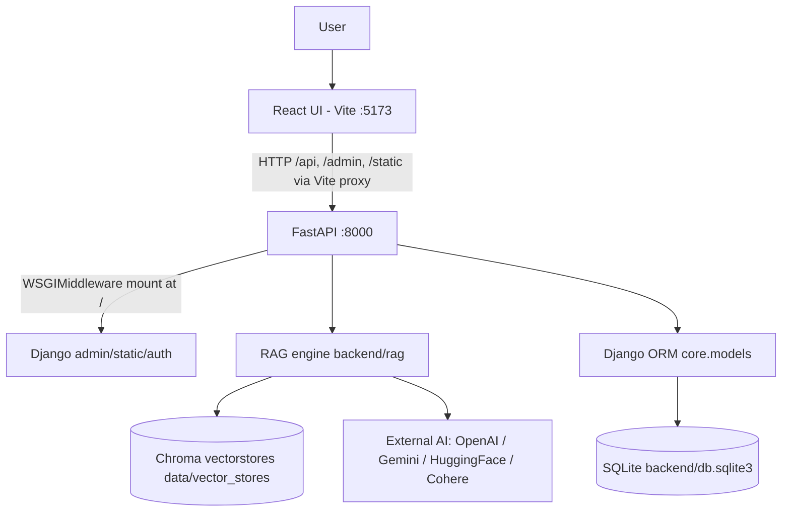
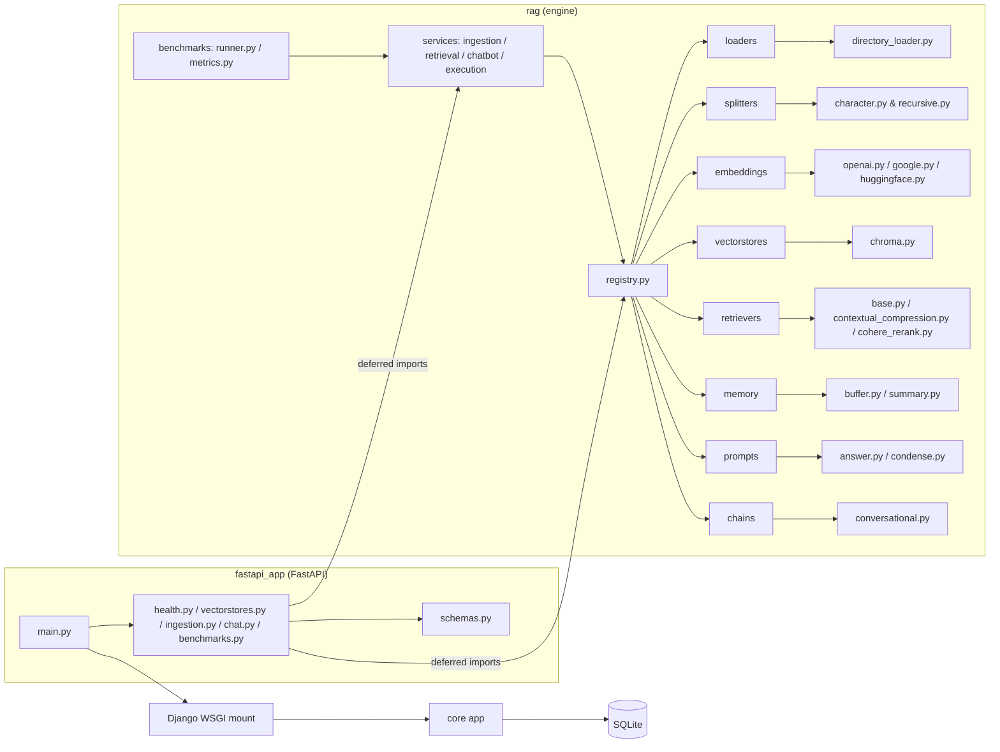

# 02 — Architecture

> How the whole system is layered and how the pieces talk to each other.

## 1. Overall shape

**Monolith, layered, in a single OS process (backend), plus a separate frontend dev server.**

There is exactly one backend process. It serves **two** web frameworks at once:

- **FastAPI** (`backend/fastapi_app/`) is the outer ASGI application. It owns every
  `/api/*` route (REST for the RAG engine).
- **Django** (`backend/config/`, `backend/core/`) is mounted *inside* FastAPI via
  `WSGIMiddleware` (`backend/fastapi_app/main.py:23,47`). It owns `/admin`, `/static`,
  the ORM, migrations, and the auth/session machinery.

Why? The README calls this a "monolithic RAG chatbot": Django contributes a mature
ORM + admin + auth, FastAPI contributes a modern async REST layer, and both share the
single `venv`, the single SQLite DB, and the same settings object
(`backend/config/settings.py`).

The frontend (`frontend/`) is a React SPA served by the **Vite dev server** on
`:5173`. It talks to the backend purely over HTTP; the Vite proxy forwards `/api`,
`/admin`, `/static` to `http://127.0.0.1:8000` (`frontend/vite.config.ts:10-24`).

### Level 1 — System graph



## 2. Components and responsibilities

| Component | Package/dir | Responsibility |
| --------- | ----------- | -------------- |
| FastAPI REST layer | `backend/fastapi_app/` | HTTP API for the frontend: health, vectorstores, ingestion, chat, benchmarks. Pydantic validation (`schemas.py`), CORS. |
| Django project | `backend/config/` | Settings, ASGI/WSGI entry, admin URLconf, loads `.env`. |
| Django app `core` | `backend/core/` | The 5 persistence models, admin registrations. |
| RAG engine | `backend/rag/` | The pluggable component library + orchestration services + benchmark harness. |
| React frontend | `frontend/src/` | Chat UI, stores UI, benchmarks UI, pipeline-trace telemetry panel. |
| Chroma | `data/vector_stores/` | Vector DB; one directory per vectorstore. |
| SQLite | `backend/db.sqlite3` | Relational metadata DB (Django ORM). |
| External AI APIs | — | Embeddings + chat completion + rerank providers. |

## 3. The RAG engine: "registry + service" pattern

This is the heart of the codebase. Understand it and the entire backend makes sense.

Each component type is a Python package under `backend/rag/<component>/` with:

1. A submodule that defines a **`create_*` factory function** (e.g.
   `rag/embeddings/openai.py::create_openai_embeddings`).
2. A package-`__init__.py` that imports the submodules and registers the factories in a
   plain dict `_REGISTRY` mapping a **string variant name → factory**.
3. Two helpers: `get_<component>(name)` → factory (with a helpful `KeyError`), and
   `list_<component>()` → the variant names.

Documented registries (verified):

| Component package | Variants (`_REGISTRY` keys) | `get_*` / `list_*` |
| ----------------- | --------------------------- | ------------------ |
| `rag.prompts` | `answer`, `condense` | `get_prompt`, `list_prompts` |
| `rag.loaders` | `directory` | `get_loader`, `list_loaders` |
| `rag.splitters` | `recursive`, `character` | `get_splitter`, `list_splitters` |
| `rag.embeddings` | `openai`, `google`, `huggingface` | `get_embeddings_factory`, `list_embeddings` |
| `rag.vectorstores` | `chroma` | `get_vectorstore_factory`, `list_vectorstores` |
| `rag.retrievers` | `base`, `contextual_compression`, `cohere_rerank` | `get_retriever_factory`, `list_retrievers` |
| `rag.memory` | `buffer`, `summary` | `get_memory`, `list_memory_types` |
| `rag.chains` | `conversational` | `get_chain`, `list_chains` |

`rag/registry.py` aggregates all eight into one `COMPONENTS` dict and exposes
`list_component_types()`. **Verified:** no current code path calls
`list_component_types()`, but the aggregate is used as documentation and the basis of
the benchmark variant matrix.

### Level 2 — Module graph (backend)



> Note on imports: the FastAPI routers and even `rag/services/*` deliberately import
> rag modules **inside function bodies** (deferred imports). This keeps startup order
> safe when `django.setup()` is called once in `fastapi_app/main.py`. The Mermaid graph
> above shows the *runtime dependency* direction, not just import-time edges.

## 4. Request lifecycle (one example — chat)

### Level 3 — File graph for a chat request

```mermaid
flowchart TD
    ChatCanvas[frontend/src/components/chat/ChatCanvas.tsx\nhandleSend] --> Client[frontend/src/api/client.ts\nsendChat]
    Client -->|POST /api/chat (Vite proxy)| ChatRouter[backend/fastapi_app/routers/chat.py]
    ChatRouter --> Emb[rag/embeddings/__init__.py\nget_embeddings_factory]
    ChatRouter --> VS[rag/vectorstores/chroma.py\nload_chroma_vectorstore]
    ChatRouter --> BR[rag/services/retrieval.py\nbuild_retriever]
    ChatRouter --> BL[rag/services/chatbot.py\n_build_llms]
    ChatRouter --> EP[rag/services/execution.py\nexecute_pipeline]
    ChatRouter --> CORE[core/models.py\nChatSession, Message]
    BR --> VSI[rag/retrievers/__init__.py\nget_retriever_factory]
    EP --> RR[rag/services/retrieval.py\nrerank_documents]
    EP --> LLM[response_llm.stream → external LLM API]
```

### Level 4 — Function graph (same request)

See `05_FUNCTION_GRAPH.md` for the full shape (condense → search → rerank → synthesize).

## 5. Dependencies and communication rules

- **Frontend never touches the DB.** It only calls the FastAPI routes.
- **FastAPI routers contain the HTTP logic** (validation, ORM reads/writes, orchestration)
  rather than a separate controller layer — the routers *are* the controllers.
- **`rag/services` contain the business pipeline** orchestration; individual stages are in
  the component packages.
- **Django ORM is used directly from FastAPI handlers** (no repository abstraction layer).
- **Component selection is string-based.** Requests carry names like `retriever:
  "cohere_rerank"`; routers look the factory up in the registry. Adding a new variant =
  add a file + register it (see `15_FEATURE_MAP.md`).
- **No event bus, no queues, no message brokers** in the app code. Chroma pulls in
  dependencies, but the app itself is synchronous request/response.

## 6. What is NOT here (verified)

- **No authentication/authorization** for the FastAPI API. The API is open; only the
  Django admin requires a login. See `10_AUTHENTICATION.md`.
- **No migrations for the `rag` app** (it has no models).
- **No background worker.** `POST /api/benchmarks` runs the benchmark synchronously in the
  request. The `BenchmarkRun` model has a `status` field that *looks* like a job model,
  but nothing executes it asynchronously.
- **No tests.** See `13_TESTING.md`.

## 7. Key architectural numbers / constants (verified)

| Constant | Value | Defined in |
| -------- | ----- | ---------- |
| Backend port | `8000` | `scripts/dev.sh`, `Makefile` |
| Frontend port | `5173` | `frontend/vite.config.ts`, `scripts/dev.sh` |
| Default chunk size / overlap | `1600` / `200` | `core.models.VectorStore` defaults, `rag/splitters/recursive.py`, `frontend/src/api/client.ts` |
| Retrieval `k` | `16` | `rag/retrievers/base.py`, `rag/services/retrieval.py`, `fastapi_app/routers/chat.py` |
| Default LLM provider | `google` (`gemini-2.5-flash`) | `fastapi_app/schemas.py` (`ChatRequest.llm_provider`) |
| Embedding model (Google) | `models/gemini-embedding-001` | `rag/embeddings/google.py` |
| Embedding model (HF) | `thenlper/gte-large` | `rag/embeddings/huggingface.py` |
| Rerank model (Cohere) | `rerank-multilingual-v3.0` | `rag/retrievers/cohere_rerank.py` |
| Chroma root | `<repo>/data/vector_stores` | `backend/config/settings.py` |