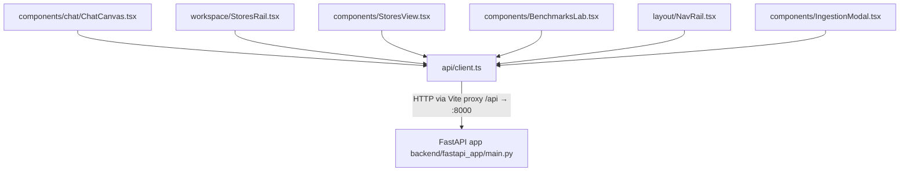
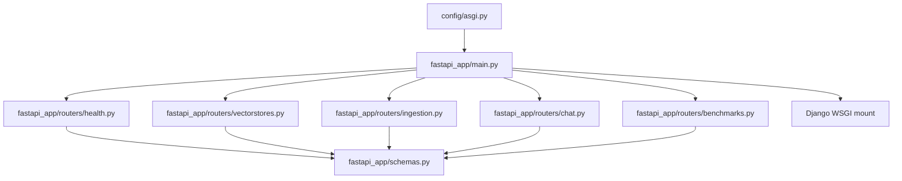
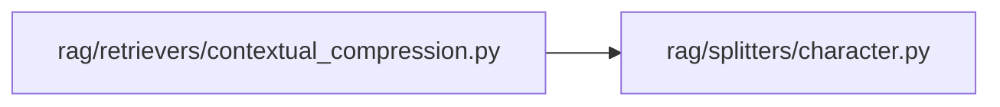
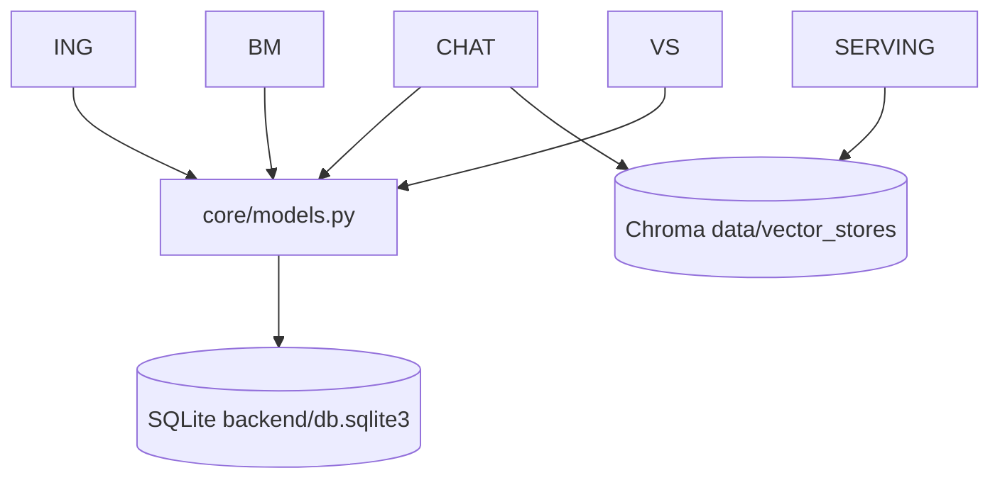

# 04 — File Graph

> A verified dependency graph of the repository at the **file** level.
> Arrow meaning: `A → B` = "A imports / depends on B".
> All edges below were confirmed by reading the source. Nothing is guessed.

## 1. Level 1 — Frontend → Backend (runtime, over HTTP)

## 2. Level 2 — Backend: FastAPI layer

## 3. Level 3 — The RAG engine (registry + services)

```mermaid
flowchart TD
    CHAT --> EMB[rag/embeddings/__init__.py]
    CHAT --> VS2[rag/vectorstores/__init__.py]
    CHAT --> VS3[rag/vectorstores/chroma.py]
    CHAT --> RETRIEV[rag/services/retrieval.py]
    CHAT --> CHATBOT[rag/services/chatbot.py]
    CHAT --> EXEC[rag/services/execution.py]
    CHAT --> MEM[rag/memory/__init__.py]
    CHAT --> PR[rag/prompts/__init__.py]
    ING --> SERVING[rag/services/ingestion.py]
    BM --> RUNNER[rag/benchmarks/runner.py]
    VS --> VS2

    SERVING --> EMB
    SERVING --> SPLIT[rag/splitters/__init__.py]
    SERVING --> VS2
    SERVING --> LOAD[rag/loaders/__init__.py]
    LOAD --> LD[rag/loaders/directory_loader.py]

    RETRIEV --> RETINIT[rag/retrievers/__init__.py]
    RETINIT --> RBASE[rag/retrievers/base.py]
    RETINIT --> RCOHERE[rag/retrievers/cohere_rerank.py]
    RETINIT --> RCOMP[rag/retrievers/contextual_compression.py]

    EXEC --> RETRIEV
    CHATBOT --> CHAIN[rag/chains/__init__.py]
    CHATBOT --> MEM
    CHATBOT --> PR
    CHAIN --> CONV[rag/chains/conversational.py]

    RCOMP --> CHARSPLIT[rag/splitters/character.py]
    SPLIT --> RECURSIVE[rag/splitters/recursive.py]
    SPLIT --> CHARSPLIT
    EMB --> EO[rag/embeddings/openai.py]
    EMB --> EG[rag/embeddings/google.py]
    EMB --> EH[rag/embeddings/huggingface.py]
    MEM --> MBUF[rag/memory/buffer.py]
    MEM --> MSUM[rag/memory/summary.py]
    PR --> PA[rag/prompts/answer.py]
    PR --> PC[rag/prompts/condense.py]
    VS2 --> VC[rag/vectorstores/chroma.py]

    RUNNER --> MTRICS[rag/benchmarks/metrics.py]
    RUNNER --> SERVING
    RUNNER --> RETRIEV
    RUNNER --> CHATBOT

    REG[rag/registry.py] --> PR
    REG --> LOAD
    REG --> SPLIT
    REG --> EMB
    REG --> VS2
    REG --> RETINIT
    REG --> MEM
    REG --> CHAIN
```

## 4. Deferred (function-local) vs eager (module-level) imports

An important subtlety verified in the source: many runtime edges (routers → rag
services, services → registries) are **function-local imports**, so they do not appear
as module import statements. The graph above shows the *effective* dependency
direction regardless of import placement. The only **implementation-level module
import** between rag packages is:

All other package-to-package edges go through `*_registry = __init__.py` files.

## 5. File → data models

## 6. File graph summary table

| File | Imports (key) | Imported by (key) | Role | Centrality |
| ---- | ------------- | ----------------- | ---- | ---------- |
| `fastapi_app/main.py` | routers, Django WSGI | `config/asgi.py` | App composition | HIGH |
| `fastapi_app/schemas.py` | pydantic | all 5 routers | Wire contract | HIGH |
| `fastapi_app/routers/chat.py` | core.models, rag services | `main.py` | Chat API | HIGH |
| `fastapi_app/routers/ingestion.py` | core.models, `rag/services/ingestion.py` | `main.py` | Ingestion API | HIGH |
| `fastapi_app/routers/vectorstores.py` | core.models, `rag/vectorstores` | `main.py` | Stores API | MEDIUM |
| `fastapi_app/routers/benchmarks.py` | `rag/benchmarks/runner.py`, core.models | `main.py` | Benchmark API | MEDIUM |
| `fastapi_app/routers/health.py` | schemas | `main.py` | Health | LOW |
| `config/settings.py` | dotenv, django | asgi, main, core.models | Config | HIGH |
| `core/models.py` | django ORM | routers, runner, admin | Persistence | HIGH |
| `core/admin.py` | core.models | Django auto-discovery | Admin | MEDIUM |
| `rag/services/ingestion.py` | rag registries | ingestion router, benchmarks runner | Ingestion pipeline | HIGH |
| `rag/services/retrieval.py` | rag.retrievers | chat router, execution, benchmarks | Retriever build + rerank | HIGH |
| `rag/services/chatbot.py` | rag chains/memory/prompts | chat router, benchmarks | LLM + chain | HIGH |
| `rag/services/execution.py` | langchain, `rag.services.retrieval` | chat router | Stage-timed execution | HIGH |
| `rag/benchmarks/runner.py` | services, metrics, core | benchmarks router | Benchmark harness | MEDIUM |
| `rag/embeddings/__init__.py` | openai/google/hf | services, chat, runner | Embedding registry | HIGH |
| `rag/vectorstores/__init__.py` | chroma | services, vectorstores router | Vectorstore registry | MEDIUM |
| `rag/splitters/__init__.py` | character, recursive | services, contextual_compression | Splitter registry | MEDIUM |
| `rag/retrievers/__init__.py` | base/cohere/compression | services.retrieval | Retriever registry | MEDIUM |
| `rag/memory/__init__.py` | buffer, summary | chatbot, chat router | Memory registry | MEDIUM |
| `rag/prompts/__init__.py` | answer, condense | chatbot, chat router | Prompt registry | MEDIUM |
| `rag/chains/__init__.py` | conversational | chatbot | Chain registry | LOW |
| `rag/registry.py` | all eight registries | (none currently) | Aggregate registry | LOW (latent) |
| `frontend/src/api/client.ts` | fetch (relative /api) | ChatCanvas, StoresRail, StoresView, BenchmarksLab, NavRail, IngestionModal | API client | **HIGHEST — frontend hub** |
| `frontend/src/models.ts` | — | client, ChatCanvas, MessageBubble, SourceBadge, etc. | Shared types | HIGH |
| `frontend/src/components/chat/ChatCanvas.tsx` | client, TraceContext, MessageBubble, SettingsPopover, IngestionModal | ChatWorkspace | Chat logic | HIGH |
| `frontend/src/views/ChatWorkspace.tsx` | StoresRail, ChatCanvas, PipelineTrace | App route `/` | Chat page | MEDIUM |
| `frontend/src/components/telemetry/TraceContext.tsx` | models | App, ChatCanvas, MessageBubble, SourceBadge, PipelineTrace | Trace state | HIGH |
| `frontend/src/components/telemetry/PipelineTrace.tsx` | TraceContext | ChatWorkspace | Trace panel | MEDIUM |

## 7. High-centrality files — read these first

- **`frontend/src/api/client.ts`** — every frontend→backend interaction funnels through
  it. Change the API, change it here.
- **`frontend/src/components/chat/ChatCanvas.tsx`** — the chat page's brain.
- **`fastapi_app/main.py`** + **`config/asgi.py`** — how the process boots and which
  routes exist.
- **`fastapi_app/schemas.py`** — the API contract shared by all routes.
- **`core/models.py`** — the persistence contract shared by the API and the RAG benches.
- **`rag/services/ingestion.py`, `retrieval.py`, `chatbot.py`, `execution.py`** — the
  actual RAG pipeline logic.
- **`rag/embeddings/__init__.py`** — the embedding variant hub (needed to construct any
  vectorstore).

## 8. Isolated / leaf files

- `rag/retrievers/base.py` — small leaf (depends only on the injected vectorstore).
- `rag/prompts/condense.py`, `rag/memory/buffer.py`, `rag/splitters/recursive.py` —
  leaves with no dependents beyond their registry.
- `rag/benchmarks/metrics.py` — leaf; `to_report` has no callers (verified).
- `rag/registry.py` — depends on everything *but is currently depended-on by nothing*
  (latent aggregate).
- `backend/config/wsgi.py` — not used by the run path (verifiable: servers use `asgi.py`).

## 9. Circular dependencies

**None found.** The module graph is acyclic: registries → factories → services →
routers/main, with `rag/services/*` depending only on registries and LangChain. The
deferred-import pattern avoids the classic catch where `fastapi_app/main.py` needs
`django.setup()` before ORM imports.

## 10. `UNKNOWN / NEEDS VERIFICATION`

- `path_to_db/chroma.sqlite3` — an orphan Chroma DB with **no code reference**; origin
  unknown.
- Whether a future auth/tenants layer (README Phase 4) will introduce new files —
  not implemented; nothing to graph yet.