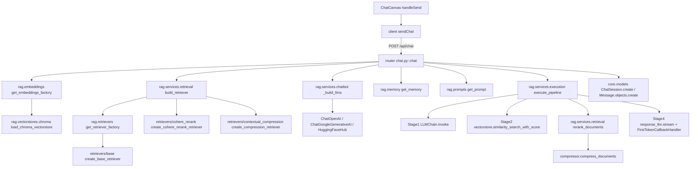

# 05 — Function Graph

> A verified **function-level** call graph for the important execution flows.
> Arrow meaning: `A → B` = "A calls B". All edges come from reading the source.

## 1. Chat flow (the main feature)



### Function detail table — chat flow

| Function | File | Params | Returns | Calls | Called by |
| -------- | ---- | ------ | ------- | ----- | --------- |
| `handleSend` | `frontend/src/components/chat/ChatCanvas.tsx` | (closure, event) | — | `sendChat` | user action |
| `sendChat` | `frontend/src/api/client.ts` | `{vector_store, question, llm_provider, model, retriever, memory?, temperature?, top_p?}` | `Promise<ChatResponse>` | `fetch POST /api/chat` | `handleSend` |
| `chat` | `backend/fastapi_app/routers/chat.py` | `ChatRequest` | `ChatResponse` | `get_embeddings_factory`, `load_chroma_vectorstore`, `build_retriever`, `_build_llms`, `get_memory`, `get_prompt`, `execute_pipeline`, models | FastAPI router |
| `_estimate_tokens` | `backend/fastapi_app/routers/chat.py` | `text: str` | `int` (len/4) | — | `chat` |
| `execute_pipeline` | `backend/rag/services/execution.py` | keyword-only `vectorstore, compressor, condense_llm, response_llm, question, chat_history, answer_prompt, condense_question_prompt, k=16` | `{answer, condensed_question, final_docs, score_map, trace}` | `LLMChain.invoke`, `similarity_search_with_score`, `rerank_documents`, `response_llm.stream`/`invoke` | `chat` |
| `rerank_documents` | `backend/rag/services/retrieval.py` | `compressor, documents, query` | `list[Document]` | `compressor.compress_documents` | `execute_pipeline` |
| `FirstTokenCallbackHandler.on_llm_new_token` | `backend/rag/services/execution.py` | `token, **kwargs` | — | `time.perf_counter` | LangChain callback |
| `build_retriever` | `backend/rag/services/retrieval.py` | `vectorstore, embeddings=None, retriever_name="base", api_keys=None` | `{retriever, base_retriever, compressor}` | `get_retriever_factory` + variant factory | `chat`, `run_benchmark` |
| `_build_llms` | `backend/rag/services/chatbot.py` | `provider, api_key, model, temperature, top_p` | `(condense_llm, response_llm)` | provider constructors | `chat`, `build_chat_engine` |

## 2. Ingestion flow

```mermaid
flowchart TD
    ingestAPI[router ingestion.py::ingest_documents] --> runIngest[rag.services.ingestion ingest_documents]
    runIngest --> loadDocs[load_documents] 
    loadDocs --> getLoader[loaders.get_loader directory]
    getLoader --> dirLoader[directory_loader.create_directory_loader().load]
    runIngest --> getSplit[rag.splitters get_splitter recursive]
    getSplit --> splitter[recursive.create_recursive_splitter]
    runIngest --> getEmb[rag.embeddings get_embeddings_factory openai]
    splitter --> splitDocs[splitter.split_documents]
    runIngest --> getVS[rag.vectorstores get_vectorstore_factory chroma]
    getVS --> createChroma[chroma.create_chroma_vectorstore]
    createChroma --> fromDocs[Chroma.from_documents]
    ingestAPI --> persist[core.models Document.update_or_create + VectorStore.save]
```

### Function detail table — ingestion

| Function | File | Params | Returns | Calls | Called by |
| -------- | ---- | ------ | ------- | ----- | --------- |
| `ingest_documents` (router) | `fastapi_app/routers/ingestion.py` | `vector_store, files, embedding_provider="openai", splitter="recursive", chunk_size=1600, chunk_overlap=200` | `DocumentIngestResponse` | `rag.services.ingestion.ingest_documents`, VectorStore/Document ORM | FastAPI router |
| `ingest_documents` (service) | `rag/services/ingestion.py` | `documents=None, tmp_dir, splitter_name, embeddings_name, vectorstore_name, persist_directory, api_keys, chunk_size, chunk_overlap` | `{vectorstore, chunk_count, config}` | `load_documents`, `get_splitter`, `get_embeddings_factory`, `get_vectorstore_factory` | router, `run_benchmark` |
| `load_documents` | `rag/services/ingestion.py` | `tmp_dir=""` | `list[Document]` | `get_loader("directory")` → `.load()` | `ingest_documents` |

## 3. Benchmark flow

```mermaid
flowchart TD
    benchmarkAPI[router benchmarks.py::create_benchmark] --> buildMatrix[runner build_matrix]
    benchmarkAPI --> runBench[runner run_benchmark]
    runBench --> ingestB[services.ingestion ingest_documents (timed)]
    runBench --> getEmbB[embeddings get_embeddings_factory]
    runBench --> buildRetB[services.retrieval build_retriever]
    runBench --> buildChain[services.chatbot build_chat_engine]
    buildChain --> buildLlmsB[chatbot _build_llms]
    buildChain --> chainB[chains get_chain conversational]
    buildChain --> memB[memory get_memory]
    buildChain --> promptB[prompts get_prompt]
    buildChain --> chainInvoke[chain.invoke question (timed)]
    runBench --> benchModel[core.models BenchmarkRun save/refresh]
    runBench --> metrics2[benchmarks.metrics Metrics]
```

### Function detail table — benchmark

| Function | File | Params | Returns | Calls | Called by |
| -------- | ---- | ------ | ------- | ----- | --------- |
| `build_matrix` | `rag/benchmarks/runner.py` | `config_matrix: dict[str, list[str]]` | `list[dict]` (cartesian product) | — | `create_benchmark` |
| `run_benchmark` | `rag/benchmarks/runner.py` | `run` (BenchmarkRun) | `None` (mutates run) | `ingest_documents`, `get_embeddings_factory`, `build_retriever`, `build_chat_engine`, `chain.invoke`, `Metrics`, ORM | `create_benchmark` |
| `build_chat_engine` | `rag/services/chatbot.py` | `retriever, llm_provider, model, language, memory_name, api_keys, temperature, top_p` | `{chain, memory}` | `_build_llms`, `get_memory`, `get_chain` | `run_benchmark` |
| `Metrics.__enter__/__exit__` | `rag/benchmarks/metrics.py` | — | sets `elapsed_ms` | `time.perf_counter` | `run_benchmark` |

## 4. Chat-engine variant (benchmark path) details

`build_chat_engine` is the second chain-assembly path in the codebase (the API chat path
uses the explicit `execute_pipeline` instead). Do not confuse the two:

| Concern | API chat path (`POST /api/chat`) | Benchmark path (`run_benchmark`) |
| ------- | ------------------------------- | -------------------------------- |
| Chain | none (explicit pipeline) | `ConversationalRetrievalChain` via `get_chain("conversational")` |
| Memory | `get_memory("buffer"/"summary")` | `memory_name="buffer"` hardcoded |
| LLM provider | from request | `"google"` hardcoded |
| Retrieval | `k=16` hardcoded in chat router | base retriever `k=16` |

## 5. Function relationship table (all important functions)

| Function | File | Calls | Called by | Purpose | Category |
| -------- | ---- | ----- | --------- | ------- | -------- |
| `chat` | `routers/chat.py` | see §1 | FastAPI | Answer a question w/ RAG + trace | API |
| `ingest_documents` (router) | `routers/ingestion.py` | service ingest + ORM | FastAPI | Ingest uploads | API |
| `list_vectorstores` | `routers/vectorstores.py` | ORM annotate, `rag.vectorstores.list_vectorstores`, dir scan | FastAPI | List stores | API |
| `create_vectorstore` | `routers/vectorstores.py` | `VectorStore.get_or_create` | FastAPI | Create store record | API |
| `create_benchmark` | `routers/benchmarks.py` | `build_matrix`, `run_benchmark` | FastAPI | Run benchmark | API |
| `list_benchmarks` / `get_benchmark` | `routers/benchmarks.py` | ORM | FastAPI | List/get runs | API |
| `health` | `routers/health.py` | `get_version` | FastAPI | Liveness | API |
| `execute_pipeline` | `rag/services/execution.py` | condense/search/rerank/synthesize | `chat` | Stage-timed RAG run | Business logic |
| `ingest_documents` (service) | `rag/services/ingestion.py` | load/split/embed/persist | router, runner | Ingestion pipeline | Business logic |
| `build_retriever` | `rag/services/retrieval.py` | registry, variant factories | `chat`, runner | Retriever assembly | Business logic |
| `rerank_documents` | `rag/services/retrieval.py` | compressor | `execute_pipeline` | Rerank/compress | Business logic |
| `build_chat_engine` | `rag/services/chatbot.py` | llms, memory, chain | runner | Chain assembly | Business logic |
| `_build_llms` | `rag/services/chatbot.py` | provider clients | `chat`, engine | Build LLMs | Business logic |
| `build_matrix` | `rag/benchmarks/runner.py` | — | router | Variant matrix | Utility |
| `run_benchmark` | `rag/benchmarks/runner.py` | services, ORM | router | Benchmark exec | Business logic |
| `get_embeddings_factory` | `rag/embeddings/__init__.py` | map lookup | services, chat, runner | Registry lookup | Utility |
| `get_splitter` / `get_loader` / `get_memory` / `get_prompt` / `get_retriever_factory` / `get_vectorstore_factory` / `get_chain` | each `rag/<x>/__init__.py` | map lookup | service layer | Registry lookup | Utility |
| `list_component_types` | `rag/registry.py` | all `list_*` | **none currently** | Aggregate listing | Utility (latent) |
| `sendChat` | `frontend/src/api/client.ts` | `fetch` | `handleSend` | Chat API call | API (frontend) |
| `uploadDocuments` | `frontend/src/api/client.ts` | `fetch` | IngestionModal | Upload API call | API (frontend) |
| `getVectorStores` | `frontend/src/api/client.ts` | `fetch` | StoresRail, StoresView | Stores API call | API (frontend) |
| `handleSend` | `frontend/src/components/chat/ChatCanvas.tsx` | `sendChat`, state | user action | Send a question | Entry (frontend) |

## 6. Function categories (verified)

- **Entry functions:** `handleSend` (chat UI), `createBenchmark` button handler
  (`BenchmarksLab`), `IngestionModal` submit handler, `main()` in `manage.py`,
  `asgi.py` module body, `chatbot()` in legacy `RAG_app.py`.
- **API functions:** all handlers in `backend/fastapi_app/routers/*`.
- **Business logic functions:** the four `rag/services/*` functions listed above.
- **Database functions:** ORM calls in routers (e.g. `VectorStore.objects.get_or_create`,
  `Message.objects.create`, `Document.objects.update_or_create`,
  `BenchmarkRun.objects.create`) — there is **no separate repository layer**.
- **Utility functions:** registry `get_*`/`list_*`, `_estimate_tokens`, `handle<T>`
  (frontend), `cn`/`formatMs` (frontend helpers).
- **External integration functions:** `create_openai_embeddings`,
  `create_google_embeddings`, `create_hf_embeddings`, `_build_llms`,
  `create_cohere_rerank_retriever`, and the actual provider calls inside
  `execute_pipeline` (stream/invoke) and `build_chat_engine`.