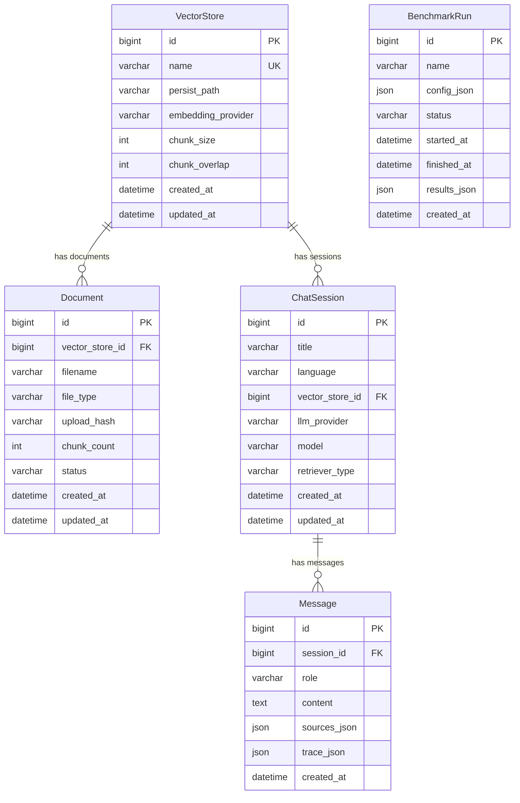

# 09 — Database

> SQLite relational DB (`backend/db.sqlite3`) + Chroma vector DB (`data/vector_stores/`).
> All ORM code lives in `backend/core/models.py`.

---

## 1. Technology

| Store | Engine | Path | Purpose |
| ----- | ------ | ---- | ------- |
| Relational | SQLite | `backend/db.sqlite3` | Metadata: vectorstores, documents, sessions, messages, benchmarks |
| Vector | Chroma (chromadb 0.4.22) | `data/vector_stores/<name>/chroma.sqlite3` + HNSW `.bin` files | Embeddings + raw text chunks |

SQLite is configured in `backend/config/settings.py:79-84`:
```python
DATABASES = {
    "default": {
        "ENGINE": "django.db.backends.sqlite3",
        "NAME": BASE_DIR / "db.sqlite3",
    }
}
```
Chroma has **no Django integration**; it is managed entirely by LangChain.

---

## 2. Django ORM tables (ER diagram)



---

## 3. Table details (verified from `core/models.py` + migrations)

### `VectorStore` (`core_vectorstore`)

| Field | Type | Constraints | Notes |
| ----- | ---- | ----------- | ----- |
| `id` | `BigAutoField` | PK, auto | |
| `name` | `CharField(255)` | **UNIQUE** | e.g. `"CV"`, `"my-kb"` |
| `persist_path` | `CharField(1024)` | blank=True | e.g. `"/…/data/vector_stores/CV"` |
| `embedding_provider` | `CharField(32)` | choices: `openai`/`google`/`huggingface`, default `openai` | |
| `chunk_size` | `PositiveIntegerField` | default `1600` | Added in migration 0002 |
| `chunk_overlap` | `PositiveIntegerField` | default `200` | Added in migration 0002 |
| `created_at` | `DateTimeField` | auto_now_add | |
| `updated_at` | `DateTimeField` | auto_now | |

### `Document` (`core_document`)

| Field | Type | Constraints | Notes |
| ----- | ---- | ----------- | ----- |
| `id` | `BigAutoField` | PK | |
| `vector_store_id` | FK → `VectorStore` | `on_delete=CASCADE`, `related_name="documents"` | |
| `filename` | `CharField(1024)` | | Original upload name |
| `file_type` | `CharField(16)` | blank=True | e.g. `pdf`, `txt` |
| `upload_hash` | `CharField(64)` | blank=True | SHA-1 hex of original bytes |
| `chunk_count` | `PositiveIntegerField` | default `0` | Chunks from this file |
| `status` | `CharField(16)` | choices: `pending`/`processing`/`ingested`/`failed`, default `pending` | |
| `created_at` | `DateTimeField` | auto_now_add | |
| `updated_at` | `DateTimeField` | auto_now | |

### `ChatSession` (`core_chatsession`)

| Field | Type | Constraints | Notes |
| ----- | ---- | ----------- | ----- |
| `id` | `BigAutoField` | PK | |
| `title` | `CharField(255)` | blank=True | Not populated by API currently |
| `language` | `CharField(32)` | default `"english"` | |
| `vector_store_id` | FK → `VectorStore` | **`on_delete=SET_NULL`, null=True**, `related_name="sessions"` | Survives store deletion |
| `llm_provider` | `CharField(32)` | blank=True | e.g. `"google"` |
| `model` | `CharField(255)` | blank=True | e.g. `"gemini-2.5-flash"` |
| `retriever_type` | `CharField(64)` | blank=True | e.g. `"base"` |
| `created_at` | `DateTimeField` | auto_now_add | |
| `updated_at` | `DateTimeField` | auto_now | |

### `Message` (`core_message`)

| Field | Type | Constraints | Notes |
| ----- | ---- | ----------- | ----- |
| `id` | `BigAutoField` | PK | |
| `session_id` | FK → `ChatSession` | `on_delete=CASCADE`, `related_name="messages"` | |
| `role` | `CharField(16)` | choices: `user`/`assistant`/`system` | |
| `content` | `TextField` | | The full text |
| `sources_json` | `JSONField` | default `[]` | `list[RetrievalSource]` |
| `trace_json` | `JSONField` | default `{}` | `ExecutionTrace` dict |
| `created_at` | `DateTimeField` | auto_now_add | Ordering: `created_at` (asc) |

### `BenchmarkRun` (`core_benchmarkrun`)

| Field | Type | Constraints | Notes |
| ----- | ---- | ----------- | ----- |
| `id` | `BigAutoField` | PK | |
| `name` | `CharField(255)` | blank=True | Default `"Benchmark"` from API |
| `config_json` | `JSONField` | default `{}` | `{config_matrix, runs}` |
| `status` | `CharField(16)` | choices: `pending`/`running`/`completed`/`failed`, default `pending` | |
| `started_at` | `DateTimeField` | null=True | Set by runner |
| `finished_at` | `DateTimeField` | null=True | Set in `finally` |
| `results_json` | `JSONField` | default `{}` | `{results: [...]}` |
| `created_at` | `DateTimeField` | auto_now_add | |

---

## 4. Relationships (verified)

| From | To | FK field | on_delete | related_name |
| ---- | -- | -------- | --------- | ------------ |
| `Document` | `VectorStore` | `vector_store_id` | `CASCADE` | `documents` |
| `ChatSession` | `VectorStore` | `vector_store_id` | **`SET_NULL`** | `sessions` |
| `Message` | `ChatSession` | `session_id` | `CASCADE` | `messages` |
| `BenchmarkRun` | — | — | — | — (standalone) |

**Cascade behavior:**
- Delete a `VectorStore` → all its `Document`s are deleted; `ChatSession`s survive
  (`vector_store_id` becomes NULL).
- Delete a `ChatSession` → all its `Message`s are deleted.

---

## 5. Migration history

| Migration | What it does | Generated date |
| --------- | ------------ | -------------- |
| `core/0001_initial.py` | Creates all 5 tables + `ChatSession.vector_store` FK (SET_NULL) | 2026-09-18 |
| `core/0002_message_trace_json_vectorstore_chunk_overlap_and_more.py` | Adds `Message.trace_json`, `VectorStore.chunk_size` (1600), `VectorStore.chunk_overlap` (200) | 2026-09-18 |

Apply with `make migrate`.

---

## 6. ORM usage by API

| API handler | ORM calls (verified) |
| ----------- | -------------------- |
| `GET /api/vectorstores` | `VectorStore.objects.annotate(document_count=Count("documents")).values(...)` |
| `POST /api/vectorstores` | `VectorStore.objects.get_or_create(...)` |
| `POST /api/documents` | `VectorStore.objects.get_or_create(...)` + `.save()`, `Document.objects.update_or_create(...)` |
| `POST /api/chat` | `VectorStore.objects.filter(name=...).first()`, `ChatSession.objects.create(...)`, `Message.objects.create(...)` ×2 |
| `POST /api/benchmarks` | `BenchmarkRun.objects.create(...)`, `.refresh_from_db()`, `.save(update_fields=[...])` |
| `GET /api/benchmarks` | `BenchmarkRun.objects.values(...)` |
| `GET /api/benchmarks/{id}` | `BenchmarkRun.objects.filter(pk=...).first()` |

---

## 7. Chroma vector DB (separate from Django ORM)

| Aspect | Detail |
| ------ | ------ |
| Managed by | LangChain (`rag/vectorstores/chroma.py`) |
| Location | `data/vector_stores/<name>/` (shared with legacy `RAG_app.py`) |
| Contents | `chroma.sqlite3` + HNSW `.bin` files (`data_level0.bin`, `header.bin`, `length.bin`, `link_lists.bin`) |
| Created | `Chroma.from_documents(documents, embedding, persist_directory)` |
| Read | `Chroma(embedding_function, persist_directory)` + `similarity_search_with_score(query, k=16)` |
| Deleted | Manual `rm -rf data/vector_stores/<name>/` — no API; Django `VectorStore` record can become orphaned |

---

## 8. Modification guide

- **Add a field:** edit `core/models.py`, run `make makemigrations migrate`, update
  `core/admin.py` if desired, update the corresponding `fastapi_app/schemas.py` model,
  update `frontend/src/models.ts`.
- **Add a model:** same, plus register in `core/admin.py`.
- **Add a relation:** decide `on_delete` carefully; the existing `ChatSession→VectorStore`
  uses `SET_NULL` (chats survive store deletion); `Document→VectorStore` uses `CASCADE`
  (docs die with their store).
- **Chroma:** never modify `data/vector_stores/` by hand while the backend is running.